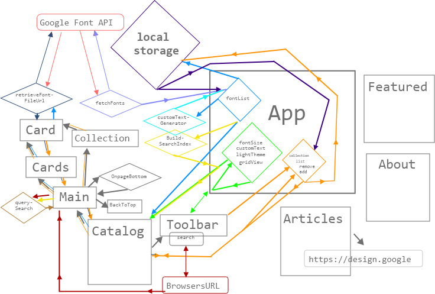

# solo-koala-54

## Chingu Voyage Pre-Work Solo Project (Tier 2): *Favorite Fonts* ##
An SPA that displays fonts from Google Fonts API sorted by popularity. Users can define a custom text, font size, and filter fonts by search term.

## Features
- Responsive layout
- Instant search, ordered priority, match terms starting with query first, then terms with words that start with query, then terms that just contain query
- Varied default sample text
- Infinate scroll loading of fonts
- User collection 

## Design considerations
As a reimplementation of the wonderfully built [Google Fonts](https://fonts.google.com/) website I wanted to expand on their minimalist feel of thin lines and simplicity, that lends itself so well to a fonts UI with a bit more playfulness. 

I design the logo to feel like alternating typewriter keys and press printed letters and the thin lines decorating the font cards as wires to give a sense they're held in place. 
The tool bar compacts down well in being grouped by search, text control, display control, reset. 
The open collection button displays a list of the last three added font that tucks away so it's present by not distracting.

I choose to use an infinate scrolling method of loading more fonts over preallocating space and lazy loading. The search is currently very basic, it matches the query to the begining of font family names. So with time that's something I may improve. 

----
## Devolpment Info

### Setup 
1. `cd dev/`
2. run `npm install` (in root folder/this location of your cloned/downloaded repo)
3. `npm start`

### Dependancies
- [create-react-app](https://reactjs.org/docs/create-a-new-react-app.html)
- [react-router-dom](https://www.npmjs.com/package/react-router-dom)
- [aphrodite](https://github.com/Khan/aphrodite)
- [Google Fonts API](https://developers.google.com/fonts/)
- [axios](https://www.npmjs.com/package/axios)
### Specification
- header
    - logo
    - site menu/page links
- catalog
    - toolbar
        - search Google Fonts
        - customise sample text
        - alter font size
        - toggle grid/bar view
        - toggle light/dark theme
        - reset all controls
    - cards
        - grid type
        - bar type
        - add to collection button
        - remove from collection button
- featured
- articles
- about
    
### Structure
#### Data flow
;

## Deployment Info
### To deploy 
1. `cd dev/`
2. `npm run deploy`

---- 
## TODO
- [x] put full stops back into text in customTextGenerator and add to count for each segment used
- [x] fix Using target="_blank" without rel="noopener noreferrer"
- [x] fix can't update umounted state in BackToTop
- [] fade in BackToTop
- [x] make OnPageBottom kick in earlier
- [x] use retrieveFontFileUrl for fonts in CollectionOpenButton instead of storing the url
- [] make collection list untuck and tuck back when fonts are added
- [x] rename Nav component to Toolbar
- [x] add some padding around collectionOpenButton
- [x] add margin between cards and toolbar on bar view
- [x] make search input not overlap display controls on small screen size 
- [] make decorative 'tiles' using fonts in featured page for featured page and apply grid styling
- [] impliment micro-animations on: 
    - [] cards 
        - on render 
           - grid view - bobble
           - bar view - grow from center
        - adding to collection - grow and bobble back
        - removing from collection - confetti 
    - [] search icon - grow and in circle flick through letters
    - [] logo on first page load - Y rotate circled letters sequentially
    - [] light/dark theme icon - to plain circle and back to moon
    - [] font size slider - grow/shrink circle
    - [] reset icon - spin 
----
